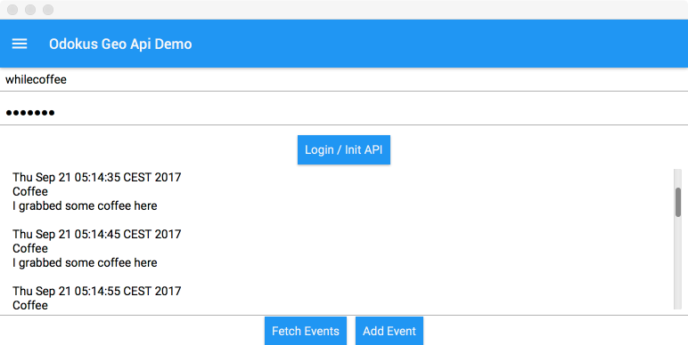

# odokus 3rd Party API Demo Application(Desktop)

Simple project to demo the use of odokus 3rd party API calls in an NetBeans project targeting Windows, macOS or Linux Clients. 

## Getting Started

These instructions will get you a copy of the project up and running on your local machine for development and testing purposes.

### Prerequisites

What things you need to install the software and how to install them

* NetBeans
* Gluon Plugin for Netbeans (install via Plugin Manager) 
* The following libraries ([Get libs](http://software.dzhuvinov.com/json-rpc-2.0-client.html))
	* json-smart-1.2.jar
	* jsonrpc2-base-1.38.jar
	* jsonrpc2-client-1.16.4jar 
* copy json* libs to libs folder in your project root
* Checkout this NetBeans project and open it
* Build the project and run it on your Desktop device

### Using the API

For more info about how to use the API in your own project, head over to the [API project site](https://github.com/Hansenhof-electronic/odokus-3rdParty-Geo-API-for-Android).

### Specials about the Desktop Version

In order to run the API Java classes for Android on Desktop Clients, you need to strip out all Android Activity and Access-Permission related code from the Api class (or at least comment them out).

Your can simply use the Api class as used in this demo project of course.

## Authors

* **Johannes Dürr** - *Initial work* - [whileCoffee](https://whilecoffee.de)

## License

This project is licensed under the MIT License - see the [LICENSE.md](LICENSE.md) file for details

## Attribution

This project uses the work of other project groups in many essential areas, which I will name here, of course, and on whose project pages I would like to refer. Without the work of these people, it would not be possible to make this example project so insanely slim and easy to understand.

* [JSON-RPC 2.0 Base + Client](http://software.dzhuvinov.com/json-rpc-2.0-client.html) from [Vladimir Dzhuvinov](http://blog.dzhuvinov.com/)